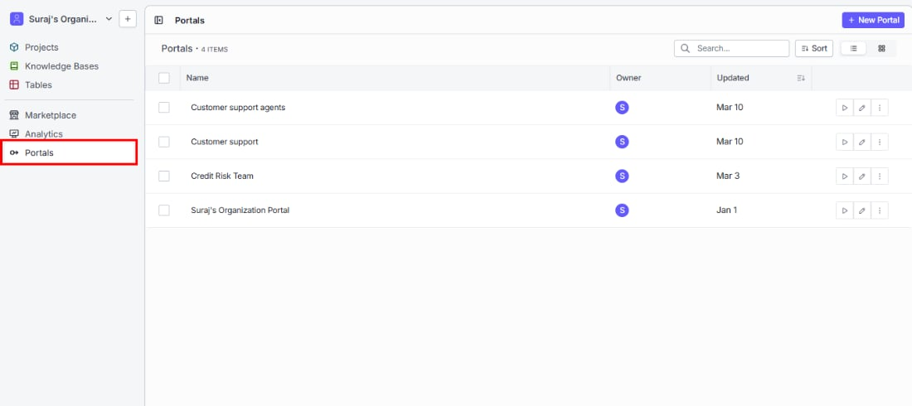
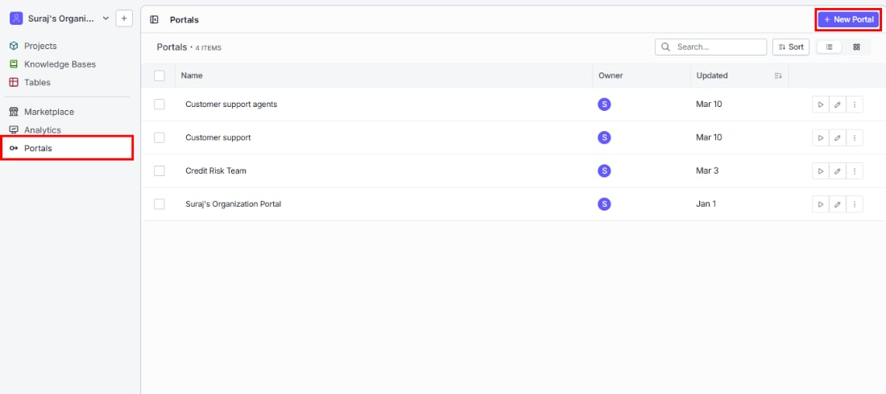
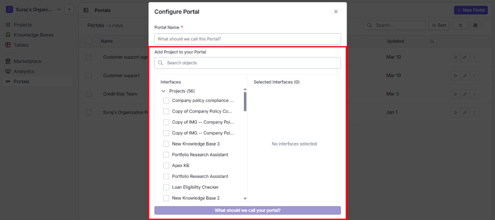

> ## Documentation Index
> Fetch the complete documentation index at: https://docs.vectorshift.ai/llms.txt
> Use this file to discover all available pages before exploring further.

# Creating a Portal

> How to access the Portals section and create a new portal

## Navigating to portals

You will find Portals in the left sidebar under the **Interfaces** section. Click **Portals** to open your Portals list.

Make sure you are in Builder or Console view — you need one of these to create or edit portals.

## Creating a new portal

To get started, click **+ New Portal** in the top right corner of the Portals list.

## Portal name

Give your portal a name that makes its purpose clear to the people who will use it — for example, "Customer Support Agents" or "Credit Risk Team." This name appears in your Portals list and at the top of the portal itself.

## Add a project to your portal

This is where you choose what your portal users will have access to.

In the Builder view, you can add entire projects. In the Console view, you can go more granular and attach individual interfaces — useful when you only want to expose specific tools from a larger project.

* **Search bar:** Quickly find the right interface by name.
* **Interfaces panel (left):** Browse all available projects in your organization. Check the ones you want to include.
* **Selected Interfaces panel (right):** Review your selections before confirming. Remove any item by clicking the **x** next to it.
