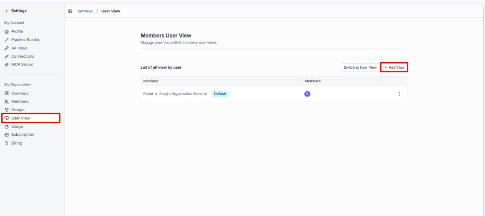
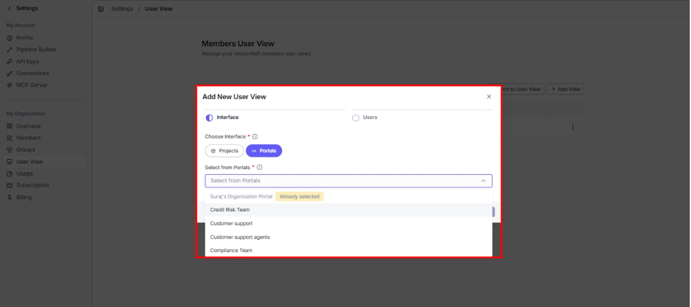
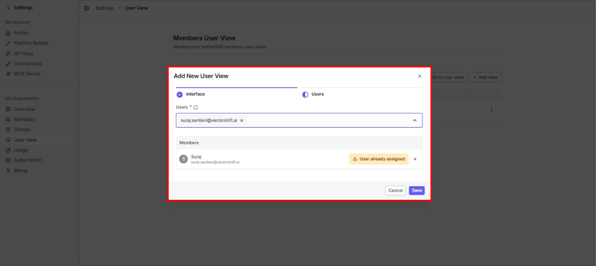
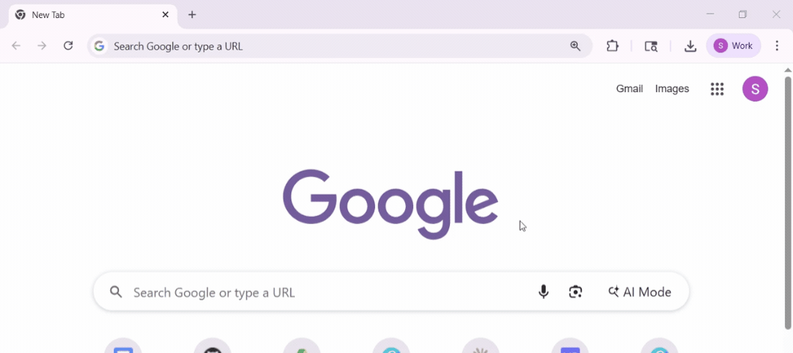
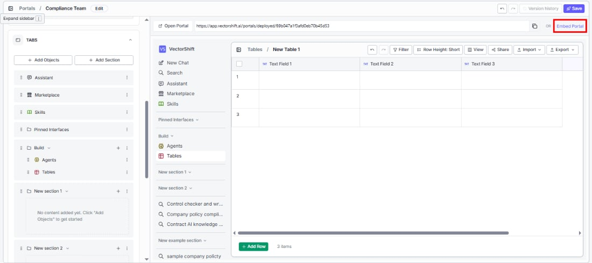
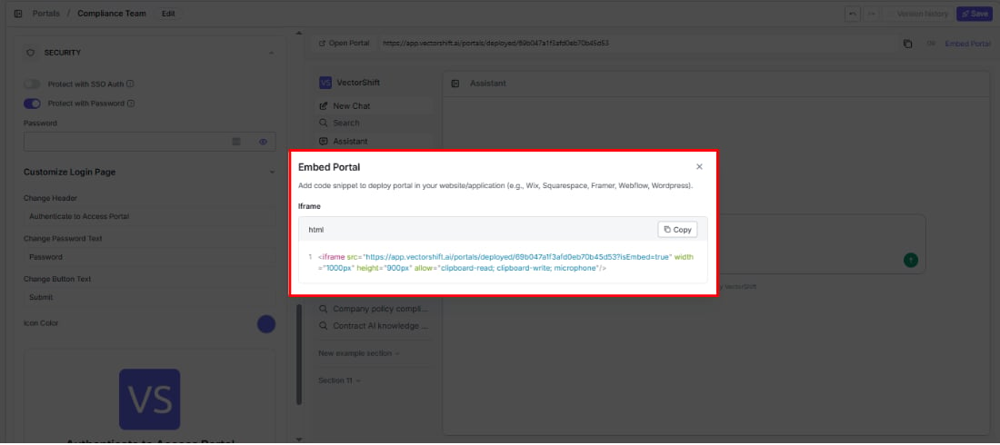
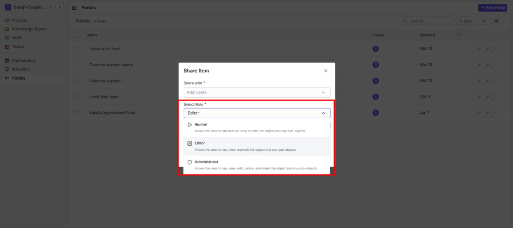
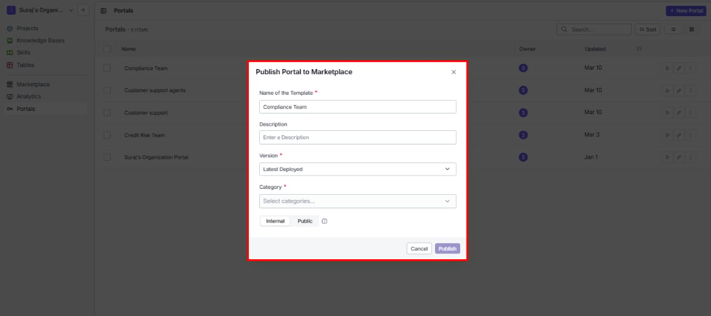

> ## Documentation Index
> Fetch the complete documentation index at: https://docs.vectorshift.ai/llms.txt
> Use this file to discover all available pages before exploring further.

# Deploying and Sharing a Portal

> How to deploy, embed, share, and publish your portal

Your portal is configured — now it is time to get it in front of your users. You have several options depending on how you want people to access it.

## Setting a portal as the default view for members

The most seamless option: make the portal the first thing specific members see when they log in. Instead of landing in the full VectorShift workspace and navigating to the portal, they open directly into it — no extra steps required.

This is managed from **Settings > User View** under the My Organization section of the left sidebar.

The **Members User View** page shows all current assignments — which portal is set for which members. A **Switch to User View** button in the top right lets you preview exactly what those members will see.

To set up a new assignment, click **+ Add View**:

### Step 1: Interface

Choose **Portals**, then select the portal you want to assign. Portals already assigned to other users show an "Already selected" label.

Click the **Users** step indicator at the top to proceed.

### Step 2: Users

Add one or more members by email. If a member is already assigned to another view, you will see a "User already assigned" warning.

Click **Save** to confirm.

Here is what that looks like in practice — a member types `app.vectorshift.ai` and lands directly in their assigned portal, no navigation needed:

<Tip>This is ideal when you want a specific team to always work inside a dedicated portal — your support team lands in the support portal, your finance team in the finance portal, without ever needing to navigate there.</Tip>

## Portal URL

Every portal gets a unique URL in the format `https://app.vectorshift.ai/portals/deployed/[portal-id]`. Copy it from the top of the preview panel in the editor and share it directly with anyone who needs access.

Click **Open Portal** to preview the live portal in a new browser tab.

## Embed portal

Want the portal to live inside your own website or app? Click **Embed Portal** to get an iframe snippet you can paste anywhere.

The snippet comes preconfigured with `clipboard-read`, `clipboard-write`, and `microphone` permissions, a default size of 1000x900px, and the portal URL with `?isEmbed=true` appended. Click **Copy** to grab it.

Works with Wix, Squarespace, Framer, Webflow, WordPress, and any platform that supports iframes.

<Tip>Adjust the width and height values to fit your page layout — the defaults are a starting point, not a constraint.</Tip>

<Note>If you are embedding in an environment with a strict Content Security Policy, make sure `clipboard-read`, `clipboard-write`, and `microphone` permissions are allowed.</Note>

## Share

Give specific people access to your portal with defined roles. From the Portals list, click the three-dot menu on a portal and select **Share**.

Add users by name or email, then assign a role:

* **Runner:** Can use the portal but cannot view or edit its configuration.
* **Editor:** Can use, view, and edit the portal and its contents.
* **Administrator:** Full control — can use, view, edit, delete, and share the portal.

The table below shows everyone with access and their current role. Roles can be changed at any time.

## Publish to Marketplace

Turn your portal into a reusable template that others in your organization (or all VectorShift users) can discover and deploy. From the Portals list, click the three-dot menu and select **Publish to Marketplace**.

* **Name of the Template:** Pre-filled with the portal name — edit if you want a different display name.
* **Description:** Explain the use case and any setup steps so others can get value quickly.
* **Version:** Choose which version to publish. Defaults to "Latest Deployed."
* **Category:** Select one or more categories to help users find your template.
* **Internal / Public:** Keep it within your organization or make it available to all VectorShift users.

Click **Publish** to submit.
