> ## Documentation Index
> Fetch the complete documentation index at: https://docs.vectorshift.ai/llms.txt
> Use this file to discover all available pages before exploring further.

# The Portal User Experience

> What end users see when they open a deployed portal

When someone opens your portal via its deployed URL, they land in a clean, standalone environment — no editor panels, no configuration options, just the tools you chose for them. Everything below describes that experience from the end user's perspective.

## Sidebar navigation

The sidebar is how your users navigate the portal. It shows your portal's name and icon at the top, followed by all the tabs you configured — in the exact order you set them.

At the top, users always have:

* **New Chat:** Start a fresh conversation with the assistant without losing previous ones.
* **Search:** Quickly find any tab by name instead of scrolling through the sidebar.

## Assistant

The assistant is the primary way your users interact with the portal. They can ask questions, tag specific interfaces using `@`, upload files, or use voice input — all from a single chat interface.

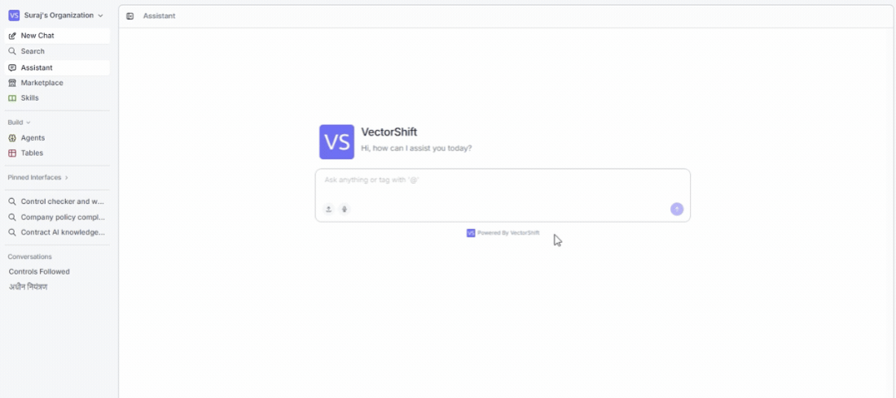

Conversations are preserved across sessions, so users can pick up right where they left off. The portal also remembers the last interface they had open, so returning users do not need to navigate from scratch every time.

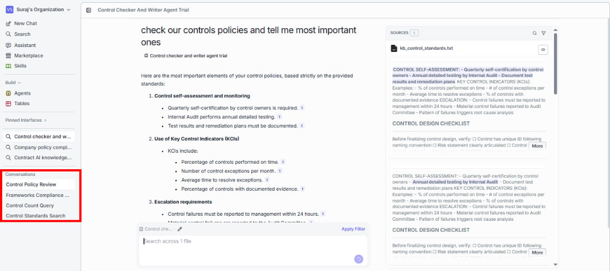

## Marketplace

The Marketplace gives your portal users access to your organization's shared template library — a place to discover, explore, and deploy pre-built solutions without building anything from scratch.

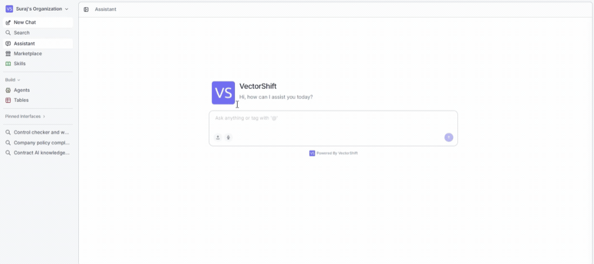

Users can toggle between two views:

* **Unpublished** (default): Browse the full marketplace to discover templates shared within your organization.
* **Published:** See only the templates you have published, so you can manage and update them.

The browse view includes filters for project type, featured templates ("Made by VectorShift" or "Verified"), and categories like Knowledge Assistants, Customer Support, Content Creation, and more. A search bar lets users find templates by keyword, category, or author.

## Build section

Your end users are not limited to consuming what you set up — they can build their own agents and tables directly inside the portal. This is especially useful when users need to create tools tailored to their specific workflows without leaving the portal environment.

As the portal creator, you decide whether to enable these options. If your use case does not call for end-user building, you can disable or remove these tabs entirely.

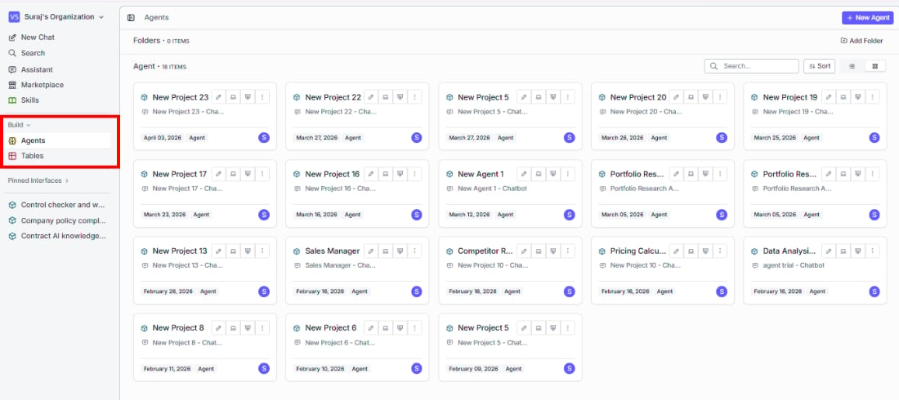

### Agents

End users can browse all available agents, then click into any one to interact with it or create their own. The Agents list shows each agent's name, type, interface, owner, and last modified date.

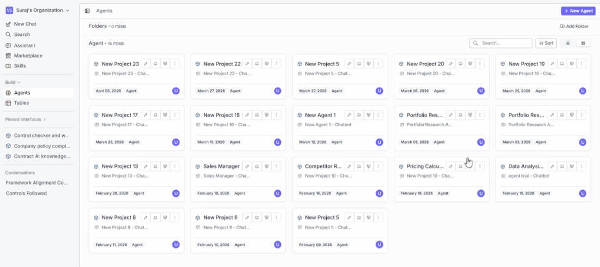

Click **+ New Agent** to open the agent builder. Once saved, the agent is immediately available inside the portal — ready to use without any extra setup.

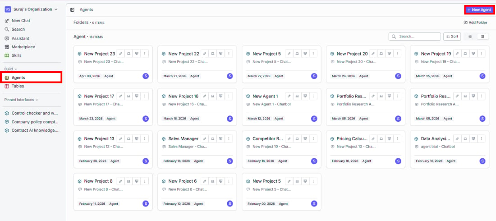

### Tables

End users can browse existing data tables and create their own. Tables they build are automatically available to agents and interfaces within the portal.

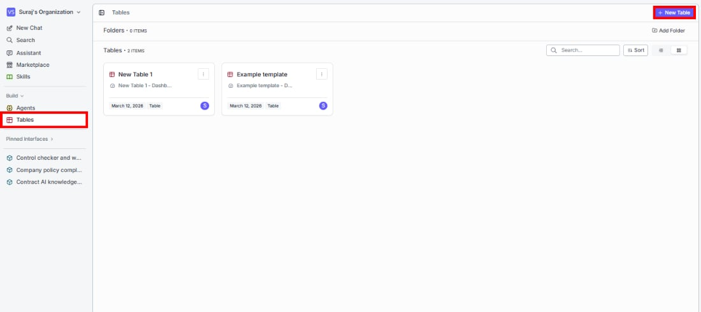

Click **+ New Table** to get started. If you have added table templates in the portal configuration, users can also create tables from those predefined structures.

<Tip>Building directly inside the portal means your users can create, test, and use agents and tables in the same environment — no switching between views or learning the full VectorShift workspace.</Tip>

## Organizing tabs into sections

As your portal grows, keeping the sidebar organized becomes important. You can group related projects into collapsible sections, remove projects that are no longer needed, and add new ones — all to make sure your users always find what they need quickly.

For example, say you have a compliance team portal. You might remove an outdated project, create a section called "Controls-related assistants" for your compliance agents, and keep a standalone project like "Pricing Calculator" at the top level since it does not belong to a specific group. Sections collapse and expand, so users can focus on what is relevant and hide the rest.

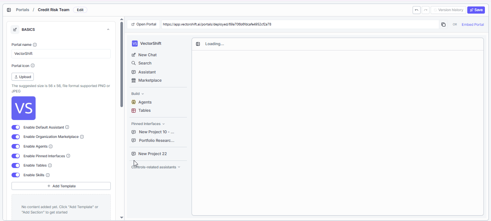

## Pinned interfaces

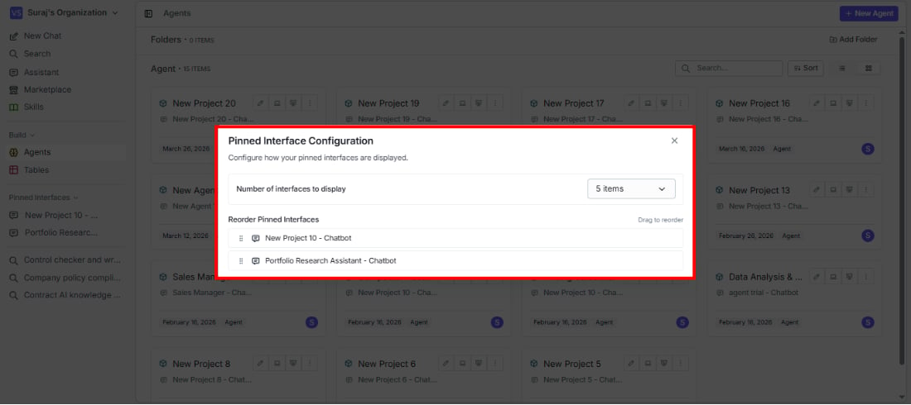

Pin your most-used interfaces to the sidebar for instant access. To pin an interface, right-click it anywhere in the portal and select **Pin Interface**. Pinned interfaces appear in a collapsible group in the sidebar — click any of them to open it directly. To reorder them, click the pencil icon next to the **Pinned Interfaces** header.

## Skills

Skills are reusable content blocks — think of them as saved prompts, templates, or reference text that agents and interfaces can pull from. Write a skill once and use it across multiple workflows.

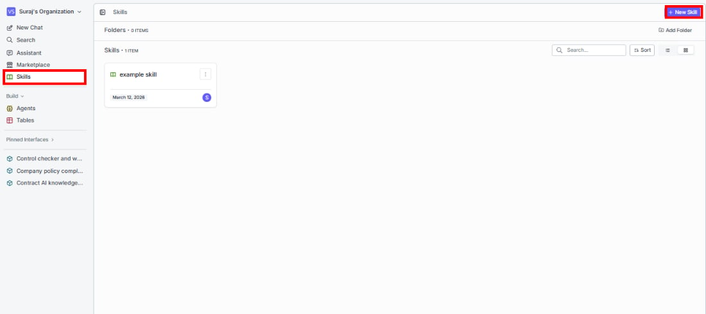

To create a skill, click **+ New Skill** and fill in:

* **Name:** What the skill is called.
* **Description:** A short summary of what it does.
* **Content:** The actual text the skill provides. Supports markdown. You can also use **Generate with AI** to create content automatically.

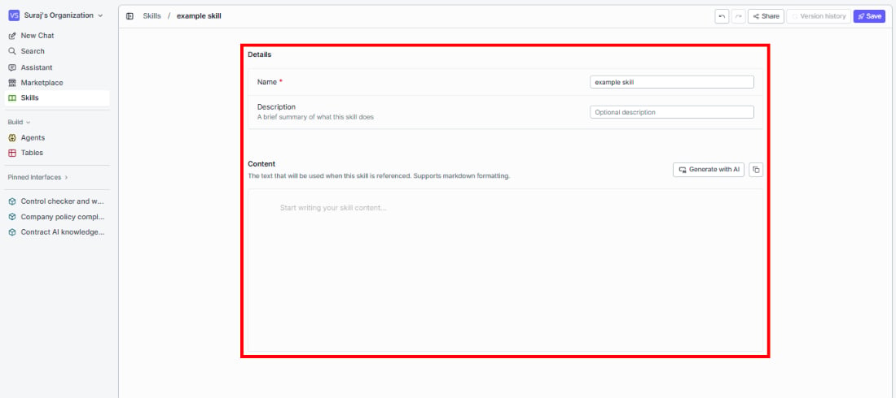
