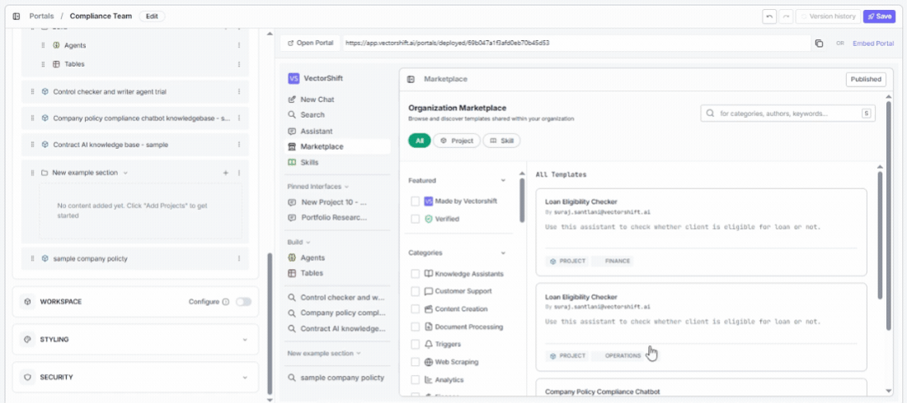
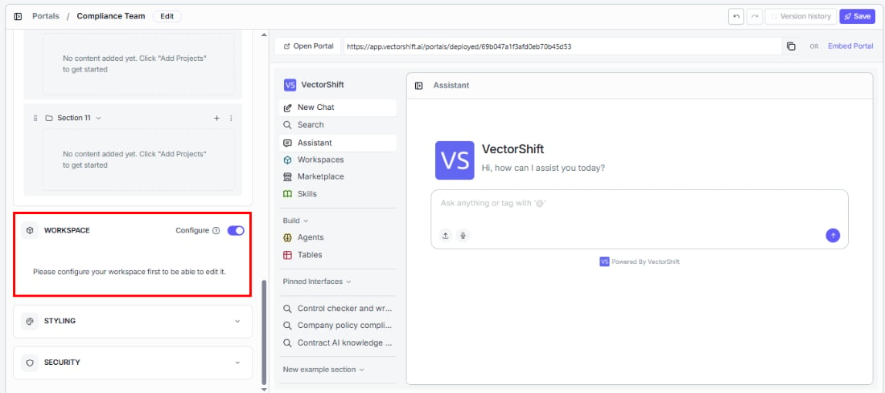
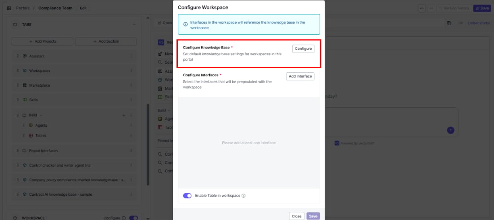
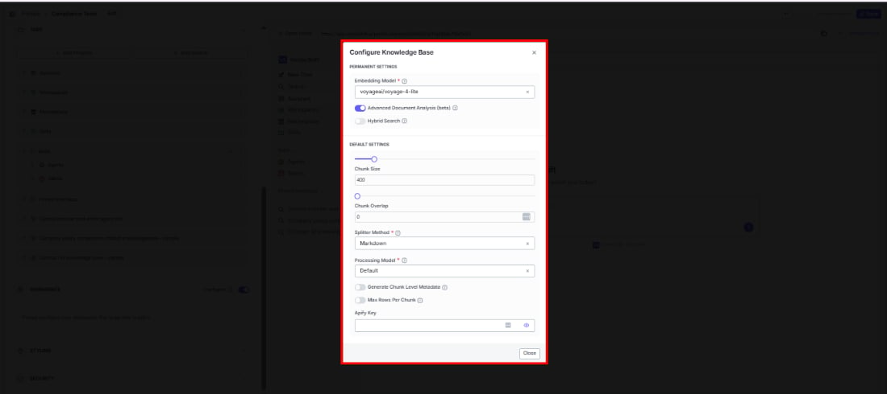
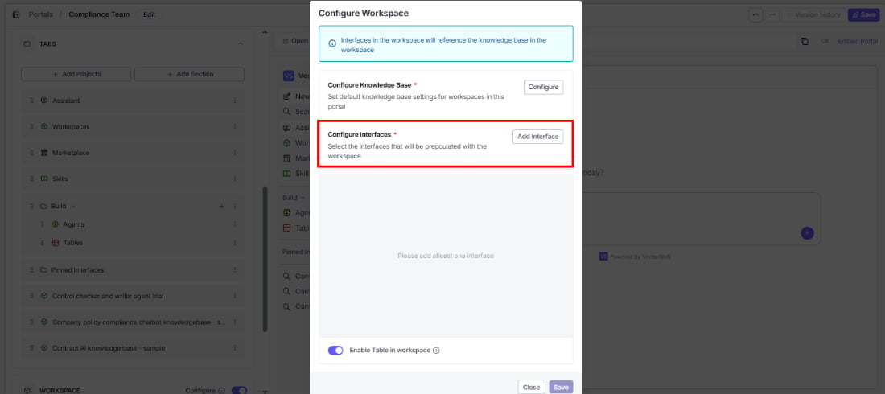
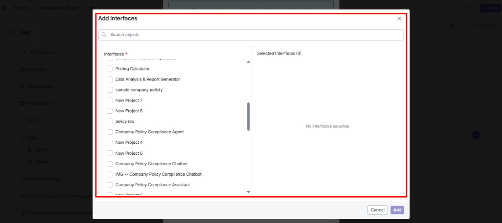
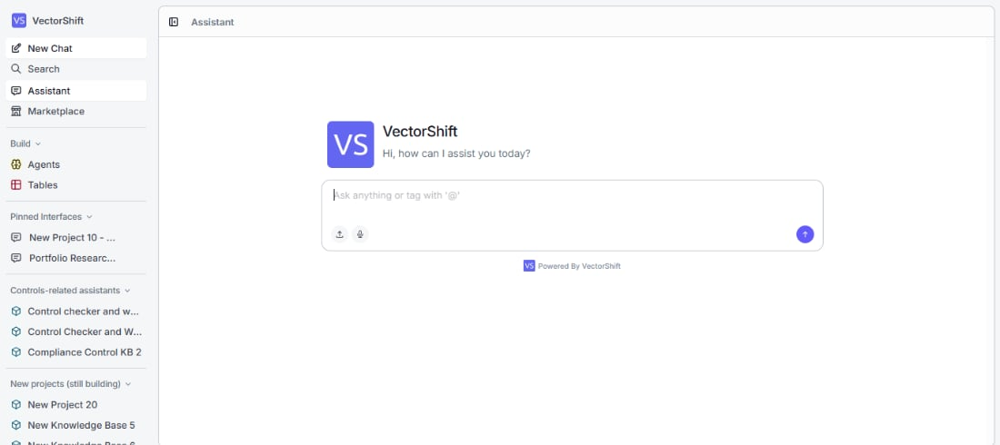

> ## Documentation Index
> Fetch the complete documentation index at: https://docs.vectorshift.ai/llms.txt
> Use this file to discover all available pages before exploring further.

# Workspace

> How to enable and configure personal workspaces for portal users

A workspace gives each portal user their own personal environment — a place to upload documents, build a personal knowledge base, run interfaces against their own data, and organize findings in tables. A credit analyst can upload loan documents and query them through the interfaces you configured. A researcher can build a personal knowledge base from papers and run analysis across them. The workspace makes this possible, all without leaving the portal.

## Enabling the workspace

Workspace is off by default. To enable it, open the portal editor and turn on the **Workspace** toggle. Then click **Configure** to set it up.

## Configuring the knowledge base

The knowledge base is the foundation of each user's workspace. Click **Configure** to set it up.

### Permanent settings

These are locked after the workspace is created — choose carefully:

* **Embedding Model (required):** How documents are converted into searchable vectors. Defaults to `voyageai/voyage-4-lite`.
* **Advanced Document Analysis (beta):** Enable deeper parsing for complex file types like scanned PDFs or mixed-format documents.
* **Hybrid Search:** Combine vector and keyword search for more accurate retrieval.

### Default settings

Users can adjust these later:

* **Chunk Size:** How large each document chunk is when ingested. Defaults to 400.
* **Chunk Overlap:** How much consecutive chunks overlap, to preserve context across chunk boundaries. Defaults to 0.
* **Splitter Method (required):** How documents are split into chunks. Defaults to Markdown.
* **Processing Model (required):** The model used during document processing. Defaults to Default.
* **Generate Chunk Level Metadata:** Automatically generate metadata for each chunk during ingestion.
* **Max Rows Per Chunk:** Set a limit on rows per chunk when processing tabular data.
* **Apify Key:** Enter your Apify API key if you want to enable web scraping integrations.

## Configuring interfaces

Choose which interfaces will be ready to use in each user's workspace from day one.

Click **Add Interface** to browse and select the interfaces you want to prepopulate.

These interfaces will automatically query the user's personal knowledge base — not the shared organization one.

<Note>This means each user's results come from their own uploaded documents, keeping data isolated between users.</Note>

## Table templates

Give users a starting structure for their tables instead of making them build from scratch. Click **Add Template** to include one of your existing tables as a template.

## Enable table in workspace

Turn this on to give each user a personal table in their workspace — useful when users need to collect, organize, or analyze data alongside their knowledge base.

## What the workspace looks like inside

Once a user creates their workspace, they get their own knowledge base, preconfigured interfaces, and tables — all in one place.

<Tip>Workspaces keep data isolated between users. Each person's uploaded documents, tables, and query results are private to their own workspace.</Tip>
