> ## Documentation Index
> Fetch the complete documentation index at: https://docs.vectorshift.ai/llms.txt
> Use this file to discover all available pages before exploring further.

# Transformations

> Execute custom code in your workflows

Transformations allow you to write custom Python code that executes during your workflows.
You can define new and edit existing Transformations by navigating to the Transformations tab.
You can access Transformations by using the Transformations node in the Home tab of the Workflow builder.

## Create a new Transformation

To create a new Transformation, you can take the following steps:

### Step 1: Navigate to the Transformations tab

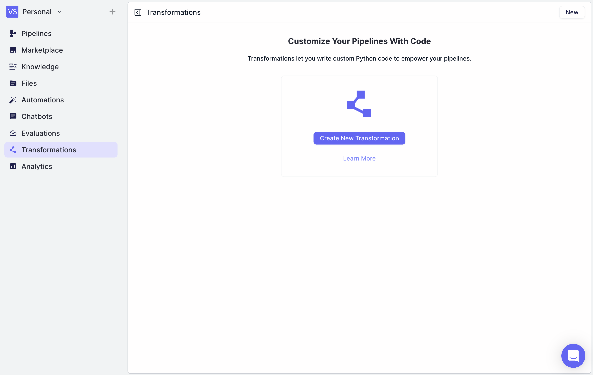

### Step 2: Click "New"

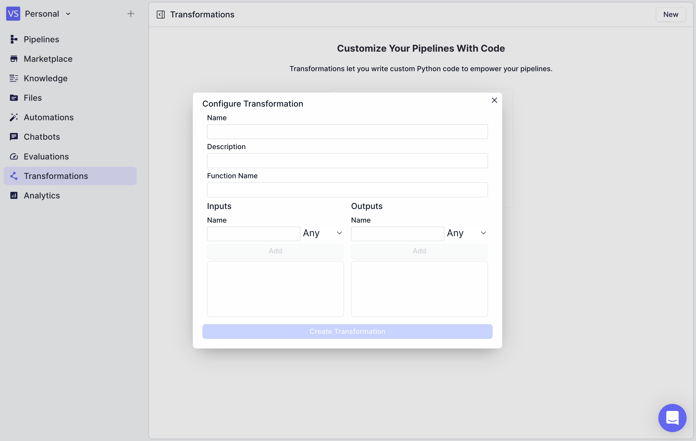

### Step 3: Define your Transformation

Enter the parameters for your transformation, including the Name, Function Name, Description, Inputs, and Outputs.
Function names, input names, and output names should be valid Python function and variable names, respectively.

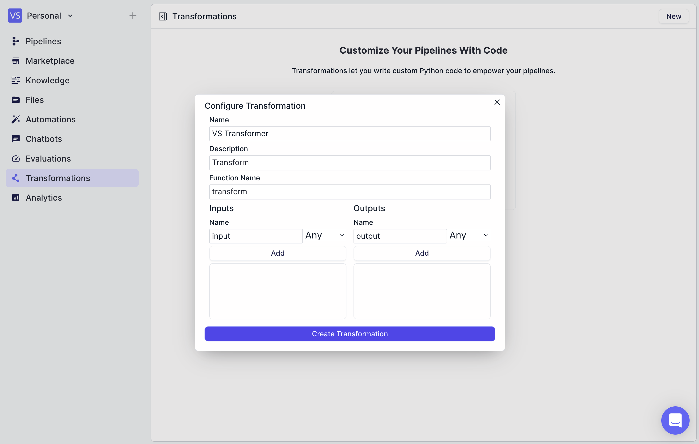

### Step 4: Make Any Changes within the Transformation Editor

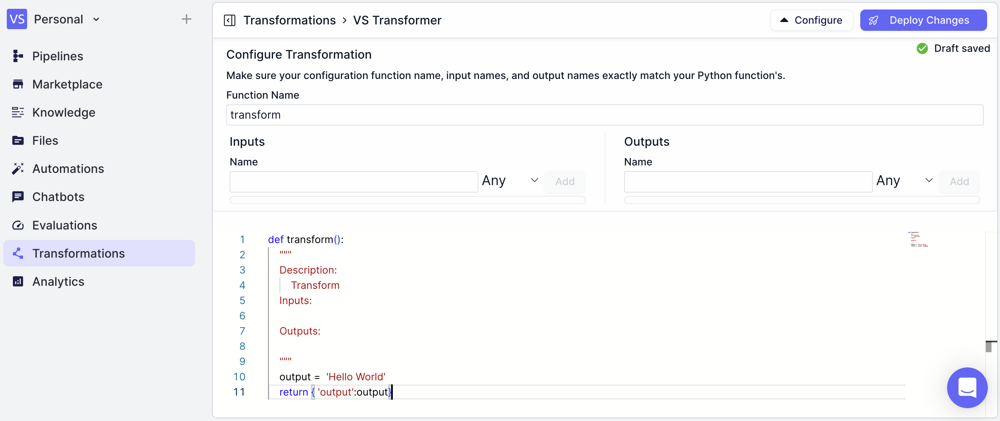

### Step 5: Use your Transformation in a Workflow

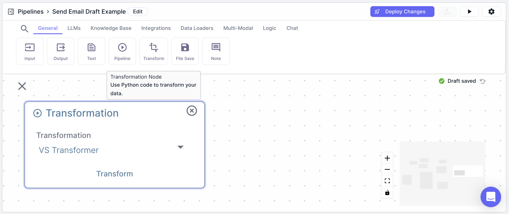

## Examples

### Example 1: Using a Transformation to display the date and time in formatted manner

### Transformation

In this example, first we will create a transformation that formats the date and time in a human-readable manner. Create a transformation with the following parameters:

* Function Name: `format_date_time`
* Description: `Formats the date and time in a human-readable manner`
* Inputs: `date_time`
* Outputs: `formatted_date_time`

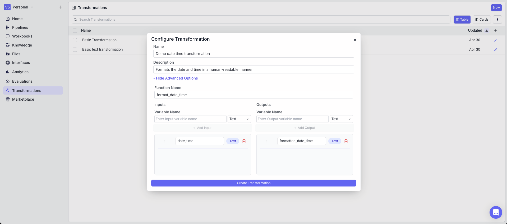

In the code, the `datetime` module is used to format the date and time.

```python theme={"languages":{}}
def format_date_time(date_time):
    from datetime import datetime

    cleaned = date_time.replace(" / ", " ")
    date_obj = datetime.strptime(cleaned, "%d/%m/%Y %H:%M:%S")
    formatted_date_time = date_obj.strftime("%d %B %Y at %H:%M:%S")
    return {'formatted_date_time': formatted_date_time}
```

Note: The imports take place in the function definition.

Also, it is a good practice to test the transformation in the editor before deploying the changes. To test the transformation, you can use the `Test Code` button in the top right corner of the editor accordion.

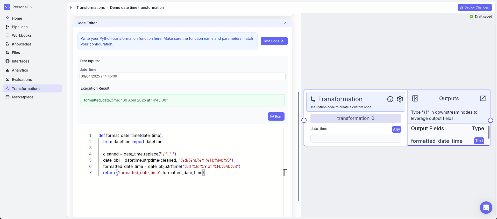

### Workflow

In this example, we will use the transformation in a workflow.

1. Time Node: Gets the current date and time
2. Transformation Node: Uses the transformation to format the date and time
   * Input: `{{time_0.output}}`
   * Transformation: `Demo date time transformation`
3. Output Node: Displays the formatted date and time
   * Output: `{{transformation_0.formatted_date_time}}`

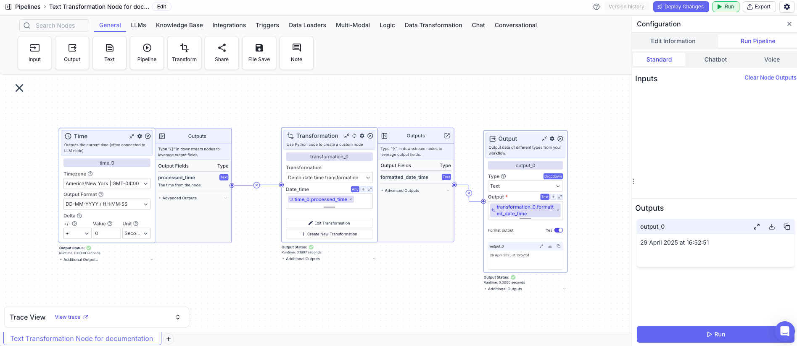

### Example 2: Using a Transformation to convert a files content to base64 and output the first 10 characters

### Transformation

In this example, we will create a transformation that converts the content of a file to base64 and outputs the first 10 characters. Create a transformation with the following parameters:

* Function Name: `file_to_base64`
* Description: `Converts the content of a file to base64 and outputs the first 10 characters`
* Inputs: `input_file`
* Outputs: `base64_content`

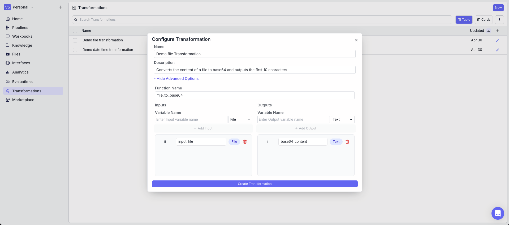

In the code, the `base64` module is used to convert the content of a file to base64.

```python theme={"languages":{}}
def file_to_base64(input_file):
    import base64
    import json
    file_content = base64.b64decode(input_file['content']) 
    base64_content = str(file_content)
    return {'base64_content': base64_content}
```

Also, it is a good practice to test the transformation in the editor before deploying the changes. To test the transformation, you can use the `Test Code` button in the top right corner of the editor accordion.

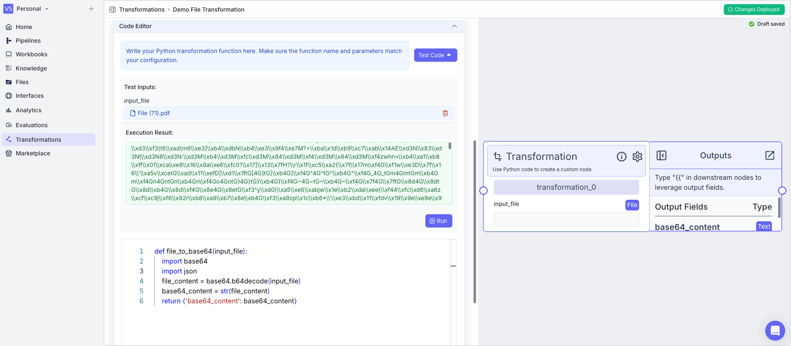

### Workflow

In this example, we will use the transformation in a workflow.

1. Input Node: takes a file as input
2. Transformation Node: Uses the transformation to convert the content of a file to base64
   * Input\_file: `{{input_0.file}}`
   * Transformation: `Demo File Transformation`
3. Output Node: Displays the base64 content of the file
   * Output: `{{transformation_0.base64_content}}`

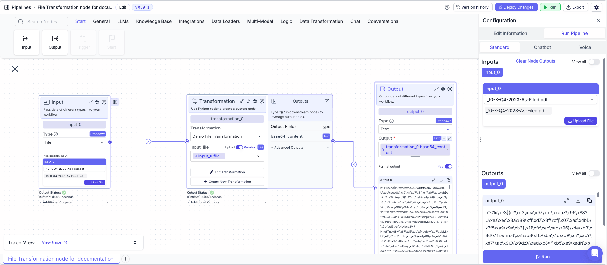
