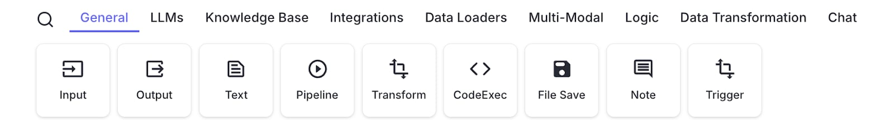
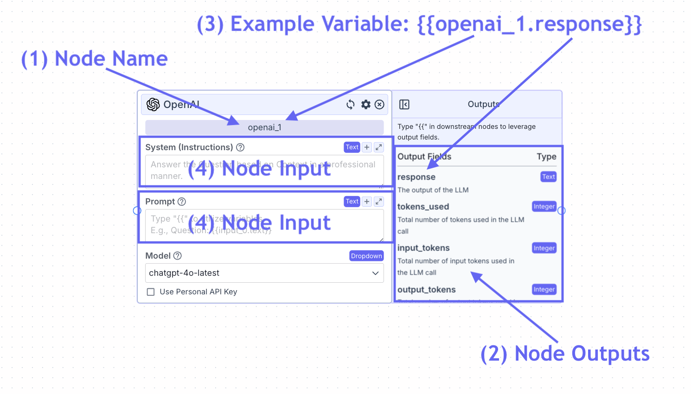
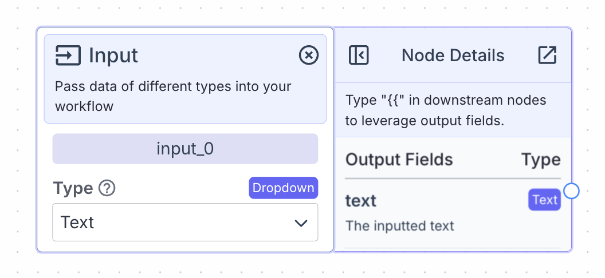
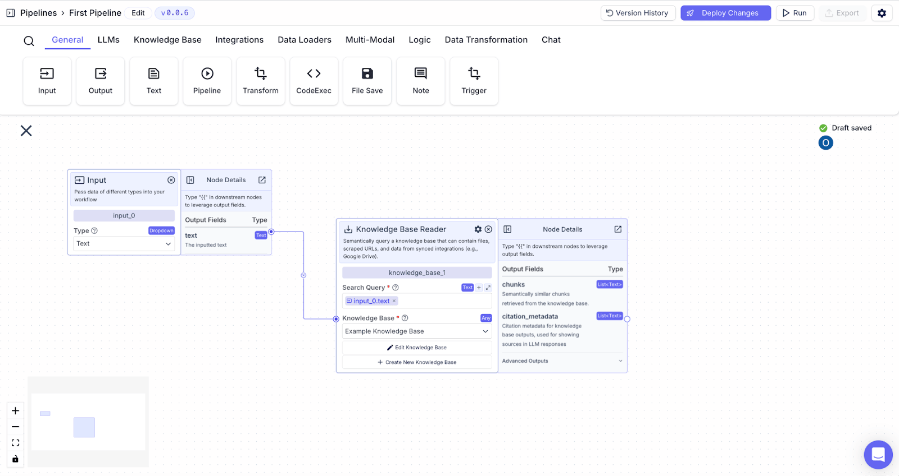
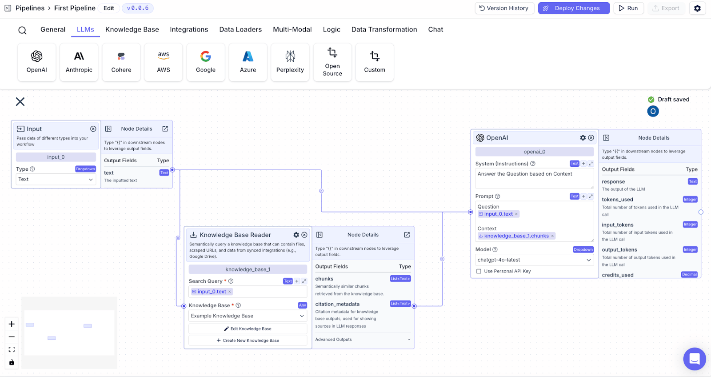
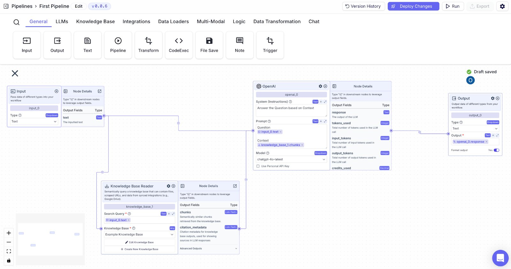
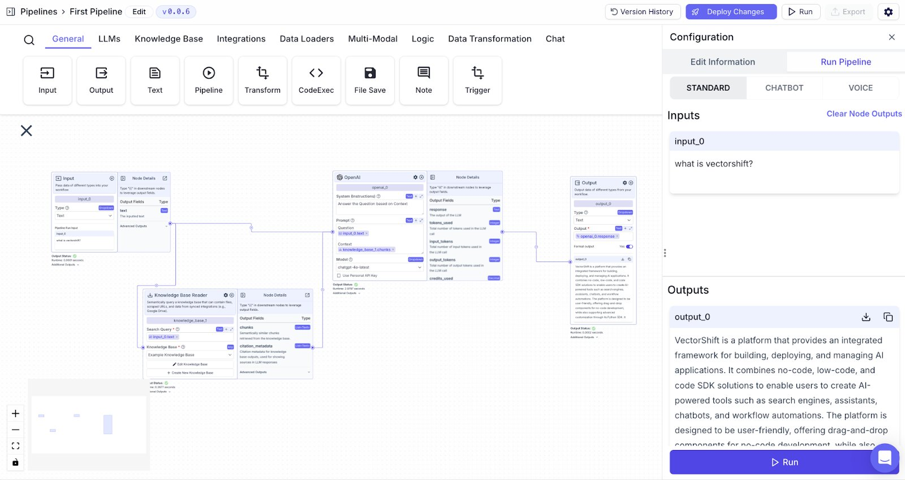
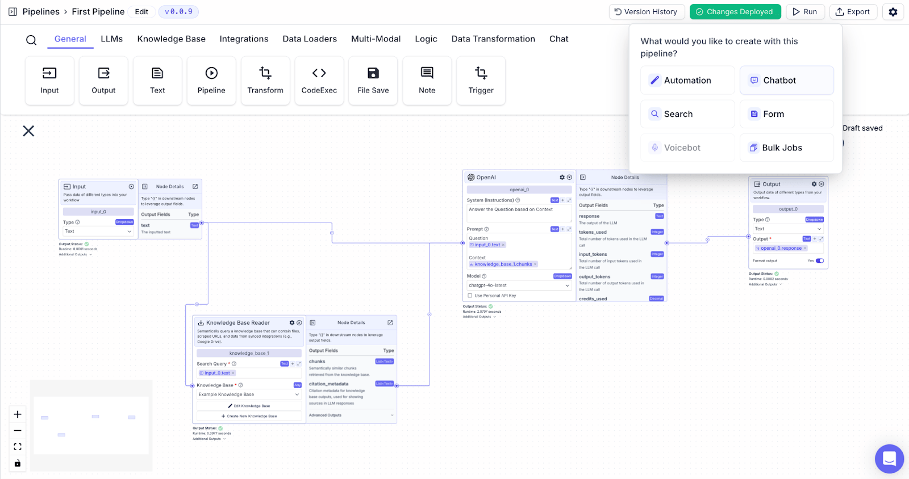

> ## Documentation Index
> Fetch the complete documentation index at: https://docs.vectorshift.ai/llms.txt
> Use this file to discover all available pages before exploring further.

# Quickstart

> Learn VectorShift's core concepts and get started with your first workflow

This is the **no-code platform** quickstart. Writing code instead?

<Card title="SDK quickstart (Python)" icon="code" href="/sdk/quickstart" horizontal>
  Install, authenticate, and run your first pipeline in Python.
</Card>

VectorShift offers a no-code interface to build workflows using modular components called nodes.

Basic Terms:

* **Node:** A modular building block used to construct workflows. Drag and drop nodes onto the no-code interface.
* **Workflow:** A series of nodes connected together to achieve a certain goal.

## Workflow Basics

Nodes are modular building block used to construct workflows. Drag and drop a node from the node menu onto the canvas.



Workflows execute from left to right. We refer to nodes that execute first as “upstream” to those that execute afterwards (“downstream”).

A few definitions:

1. **Node name:** The name of the node. This can be found in the light blue box at the top of each node (e.g., openai\_1).
2. **Edges:** “Edges” are the circular connection point to the left and right of the node respectively. You connect nodes together at these edges.
3. **Node inputs:** The node inputs are displayed on the face of the node. For example, the LLM node has the following inputs: System prompt and Prompt.  Required inputs for a given node are marked with a red asterisk.
4. **Node outputs:** The outputs of a node are displayed in the side panel on the right-hand side of the node. For example, one output for the LLM node is the response from then LLM model (e.g., response).
5. **Variables:** Utilize node outputs from upstream nodes by typing `{{` in any text field.



Each node has a specific operation that it performs (e.g., scrape a URL).
The node takes in inputs (e.g., the URL to scrape) to produce outputs (e.g., scraped content from the URL)

## Variable Deep-Dive

Variables are used to reference specific node outputs of upstream nodes.
When the workflow runs, the output field representing the variable will replace the variable in the field.

Variables have the following format: `{{[Node name].[Output]}}`

Variables always begin with double curly braces, `{{`, and end with double curly braces, `}}`.

After typing double curly braces within an input field, the variable builder will appear. The variable builder has two steps:

1. Select the node. At step 1, all the available nodes currently used on the canvas will appear.
2. Select the output field. At step 2, all the available output fields from the selected node from Step 1 will appear.


In the above example, the text output field from the input node (whatever is inputted by the user), will replace the variable in the prompt of the LLM.

## Building your first workflow

Standard workflows usually have the following structure:

Inputs -> Workflow Logic -> Output

To illustrate a standard workflow example, we will walkthrough how to build a workflow that allows users to chat with a knowledge base.

### Step 1: Add an Input Node

The input node is used to feed data inputs (e.g., the user message) into a workflow.

The input node doesn’t have any node inputs (there is no input edge on the left-hand side of the node) but has one output field: text, the text that is inputted.



### Step 2: Add a Knowledge Base

The knowledge base allows you to semantically query a database that can contain data from a variety of sources: files, scraped URLs, and/or integrations (e.g., Google Drive).

The knowledge base node has one input: the search query.

I connect the input node to the knowledge base.
Now, I want to designate the user message from the input node as the search query for the knowledge base (this allows the knowledge base to return semantically similar information to the user question).
To do this, I type `{{input_0.text}}` into the “Search Query” input field.



### Step 3: Add an LLM

In this case, the LLM node answers the user question using relevant data from the knowledge base.

The LLM node has the following inputs: System prompt (instructions for how the LLM should respond), a Prompt (data the LLM can use to respond).

Within the system prompt, I type:

```
Answer the Question based on Context
```

The “Question” is the user question. The “Context” is relevant data from the knowledge base.

Within the Prompt, I need to pass the two data sources: Question and Context.

I type:

```
Question: {{input_0.text}}
Context: {{knowledge_base_0.chunks}}
```



By writing the words “Question” and “Context” above each of the variables, I help the LLM understand that the following information is the Question or the Context (e.g., that `{{input_0.text}}` is the Question).

### Step 4: Add an Output Node

The output node is used to output data from a workflow (e.g., the response from the LLM).

The output node doesn’t have any node outputs (there is no output edge on the right-hand side of the node) but has one input field: output, the text that will be outputted.

I connect the LLM to the output node. Now, I want to designate the output of the LLM as the output of the workflow. To do this, I type `{{openai_0.response}}` into the “Output” field.



### Step 5: Run the Workflow

You can test and iterate on your workflow by clicking on “Run” in the top right of the workflow builder.

Here, you can type in a hypothetical user message (e.g., What is vectorshift?) and click “Run” on the bottom right to execute the workflow.



### Step 6: Export the Workflow as a chat app

To export the workflow as a chat app:

1. Click “Deploy Changes” on the top right
2. Click “Go to Export”
3. Click “Chatbot”
4. Name your Chatbot
5. Click “Export” on the top right
6. Click “URL”

Now you have a custom chat assistant on your data built without a single line of code!


