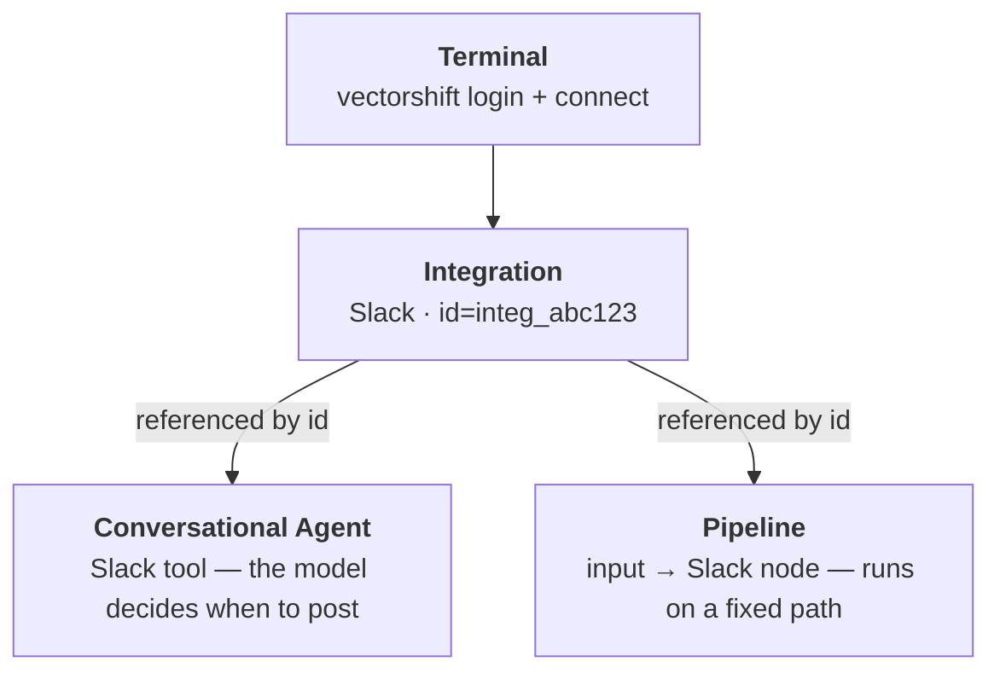

> ## Documentation Index
> Fetch the complete documentation index at: https://docs.vectorshift.ai/llms.txt
> Use this file to discover all available pages before exploring further.

# Integrations end-to-end

> Connect a third-party service with the vectorshift CLI, then put it to work — inside a conversational Agent and inside a Pipeline.

By the end of this guide you'll have a live third-party connection made from your terminal, and you'll have used that same connection two ways: as a tool an Agent can call, and as a node in a Pipeline. We'll use **Slack** as the running example, but every step is identical for the other 75 [supported types](/sdk/integrations/reference#type-catalogue).

<Info>
  **Prerequisites.** [Installed SDK](/sdk/installation) · [API key](https://app.vectorshift.ai/account/api-keys) · Python 3.10+. The `vectorshift` CLI ships with the SDK. About 15 minutes.
</Info>

## What you'll build

You connect a service **once**, then reference that single connection from anything that needs it:



<Steps>
  <Step title="Install the CLI and log in">
    The `vectorshift` command ships with the SDK. `login` stores your API key in `~/.vectorshift/config.toml`, so you only do it once per machine.

    ```bash theme={"languages":{}}
    pip install vectorshift

    # Opens the browser to grab a key, then prompts you to paste it.
    vectorshift login
    ```

    In CI, skip the browser and pass the key directly: `vectorshift login --api-key vs-…`. Any command also accepts `--api-key`, or reads `VECTORSHIFT_API_KEY` from the environment — see the [resolution order](/sdk/integrations/cli#authentication).
  </Step>

  <Step title="Connect the service">
    Every service authenticates one of two ways, and that decides how you connect it:

    | Auth mode | How you connect                                                         | Examples                                                                  |
    | --------- | ----------------------------------------------------------------------- | ------------------------------------------------------------------------- |
    | **OAuth** | Approve access on the provider's site in a browser — no secrets to copy | Slack, Gmail, Notion, Google Drive, HubSpot, Salesforce · **60 services** |
    | **Form**  | Supply credentials yourself (host, keys, tokens) — no browser needed    | Postgres, MySQL, MongoDB, Snowflake, S3, Pinecone · **16 services**       |

    Not sure which a service uses? Check the [full catalogue](/sdk/integrations/reference#type-catalogue), or ask in code: `IntegrationType.SLACK.auth_mode` → `oauth`.

    You can connect from the terminal or in Python — they do exactly the same thing. Pick the tab for your service's auth mode:

    <Tabs>
      <Tab title="OAuth (CLI)">
        `connect` opens a hosted page, waits while you authorize, and prints the new id when it goes live:

        ```bash theme={"languages":{}}
        vectorshift connect slack
        #   [pending]
        # ✓ connected slack (integ_abc123)
        ```

        On a headless box, add `--no-browser` to print the URL instead of opening it.

        <Tip>
          Slack is just one of 76 supported integration types, each with its own connect options and actions. Browse them all in the [type catalogue](/sdk/integrations/reference#type-catalogue).
        </Tip>
      </Tab>

      <Tab title="OAuth (Python)">
        `connect()` returns a `ConnectionRequest`; `.wait()` blocks until you finish consent, then hands back the live `Integration`:

        ```python theme={"languages":{}}
        from vectorshift import Integration

        slack = Integration.connect("slack").wait()
        print(slack.object_id, slack.status)   # -> integ_abc123 done
        ```

        On a headless host, pass `open_browser=False` and give the user the URL yourself:

        ```python theme={"languages":{}}
        req = Integration.connect("slack", open_browser=False)
        print("Authorize here:", req.connect_url)
        slack = req.wait()   # polls until the user finishes
        ```

        <Tip>
          Slack is just one of 76 supported integration types, each with its own connect options and actions. Browse them all in the [type catalogue](/sdk/integrations/reference#type-catalogue).
        </Tip>
      </Tab>

      <Tab title="Form (CLI)">
        Pass each credential with `--cred key=value`; the integration is created instantly, no browser:

        ```bash theme={"languages":{}}
        vectorshift connect postgres \
          --cred host=db.example.com --cred database=app \
          --cred username=reader --cred password=secret --name prod-db
        ```

        <Warning>
          `--cred` values land in your shell history. For anything sensitive, drop `--cred` and run plain `vectorshift connect postgres` to enter them in the hosted page instead.
        </Warning>

        <Tip>
          Every form service needs different `--cred` fields — Postgres wants `host`/`database`/`username`/`password`, MongoDB wants a `connection_uri`, S3 wants access keys. Look up the exact fields for your service in [credential fields](/sdk/integrations/reference#credential-fields).
        </Tip>
      </Tab>

      <Tab title="Form (Python)">
        Pass a `credentials` dict — the integration is created instantly, so `.wait()` returns without polling:

        ```python theme={"languages":{}}
        from vectorshift import Integration

        db = Integration.connect(
            "postgres",
            credentials={
                "host": "db.example.com",
                "database": "app",
                "username": "reader",
                "password": "secret",
            },
            name="prod-db",
        ).wait()
        print(db.object_id, db.status)
        ```

        A missing required field raises `MissingCredentials` *before* any network call. Look up what a type needs with `Integration.required_fields("postgres")`.

        <Tip>
          Each form service takes a different `credentials` dict — the keys for Postgres aren't the keys for Snowflake or Twilio. See the per-type [credential fields](/sdk/integrations/reference#credential-fields) for required and optional keys.
        </Tip>
      </Tab>
    </Tabs>

    Confirm what's connected — from the CLI or in Python:

    <CodeGroup>
      ```bash CLI theme={"languages":{}}
      vectorshift integrations list
      # integ_abc123    slack       done    Acme workspace
      # integ_def456    postgres    done    prod-db
      ```

      ```python Python theme={"languages":{}}
      from vectorshift import Integration

      for i in Integration.list():
          print(i.object_id, i.type, i.status, i.name)
      ```
    </CodeGroup>

    See the [CLI reference](/sdk/integrations/cli) for every command, and the [Python reference](/sdk/integrations/reference#connect) for every `connect` option.
  </Step>

  <Step title="Grab the integration in Python">
    If you connected from the terminal, get a handle to that connection in Python before wiring it into anything (if you connected in Python above, you already have it). Either way, check it's healthy first.

    ```python theme={"languages":{}}
    from vectorshift import Integration

    # By id (from `integrations list`) or by name.
    slack = Integration.fetch(id="integ_abc123")

    # Or discover it — list() takes an optional type filter.
    slack = next(i for i in Integration.list(type="slack"))

    print(slack.object_id, slack.type, slack.get_status())  # -> integ_abc123 slack done
    ```

    `get_status()` returns `done`, `loading`, or `unhealthy`. If it's `unhealthy`, refresh the auth in place with `slack.reauth().wait()` (or `vectorshift reauth <id>`).
  </Step>

  <Step title="Let an Agent act on it">
    An integration tool binds a connected service to an Agent. Pass the `Integration` object for a **static** binding (the agent always uses this workspace) and pin the `action`; let the model fill the rest at call time with a `ToolInput`.

    ```python theme={"languages":{}}
    from vectorshift.agent import Agent, AgentType, LlmInfo, MemoryConfig
    from vectorshift.agent.tool import ToolApprovalConfig, ToolInput, ToolInputType
    from vectorshift.agent.tools import IntegrationSlackTool

    post_to_slack = IntegrationSlackTool(
        tool_name="post_to_slack",
        tool_description="Post a message to the team's #alerts Slack channel.",
        action="send_message",
        integration=slack,          # static: bound to the connection you fetched
        channel="#alerts",
        message=ToolInput(
            type=ToolInputType.DYNAMIC,
            description="The message text to post",
        ),
        approval_config=ToolApprovalConfig.LET_AGENT_DECIDE,
    )

    agent = Agent.new(
        name="Ops assistant",
        type=AgentType.CONVERSATIONAL,
        llm_info=LlmInfo(provider="openai", model_id="gpt-5.1"),
        tools=[post_to_slack],
        instructions=(
            "When the user asks you to notify the team, post a concise "
            "message to #alerts with the post_to_slack tool."
        ),
        memory_config=MemoryConfig(enable_session_memory=True),
    )
    print(f"agent id={agent.id} tools={[t.name for t in agent.tools]}")
    ```

    Run one turn through a session and the model will call `post_to_slack` on its own:

    ```python theme={"languages":{}}
    import asyncio
    from vectorshift.events import SessionEventType

    async def main():
        async with await agent.create_session() as session:
            await session.send("Let the team know the deploy just finished.")
            async for event in session.listen():
                if event.type == SessionEventType.TOOL_CALL:
                    print(f"[tool] {event.tool_name}({event.data})")
                elif event.type == SessionEventType.MESSAGE_DELTA:
                    print(event.delta, end="", flush=True)
                elif event.type == SessionEventType.MESSAGE_COMPLETE:
                    print(); break

    asyncio.run(main())
    ```

    <Tip>
      Want the *caller's* Slack rather than one fixed workspace? Pass `integration=ToolInput(type=ToolInputType.DYNAMIC, …)` instead of the object, and the LLM supplies the integration at call time as `$object.integration.<ID>`. See the [integration tools reference](/sdk/agent/tools/integrations).
    </Tip>
  </Step>

  <Step title="…or run it deterministically in a Pipeline">
    When the flow is fixed — no model deciding when to fire — a Pipeline is the better shape. The same integration slots in as a node; wire an input into its `message`.

    ```python theme={"languages":{}}
    from vectorshift import Pipeline

    PIPELINE_NAME = "slack-notifier"
    try:
        pipeline = Pipeline.fetch(name=PIPELINE_NAME)
    except Exception:
        pipeline = Pipeline.new(name=PIPELINE_NAME)

    body = pipeline.add(name="input_0").input(
        input_type="string", description="Message to post",
    )
    pipeline.add(name="slack_node").integration_slack(
        integration=slack,          # the Integration object from step 3
        action="send_message",
        channel="#alerts",
        message=body.text,
    )
    pipeline.save()

    result = pipeline.run(inputs={"input_0": "Nightly batch finished ✅"})
    print(result)
    ```

    Nodes dedup by `name`, so the fetch-or-create guard keeps re-runs idempotent. Every service exposes its own node builder (`integration_gmail`, `integration_notion`, …) with per-action parameters — browse them in the [integration nodes reference](/sdk/pipeline/nodes/integration).
  </Step>

  <Step title="Keep it healthy">
    Connections drift — tokens expire, credentials rotate. Manage them from the CLI or the SDK; the two are interchangeable.

    ```bash theme={"languages":{}}
    vectorshift status integ_abc123      # done | loading | unhealthy
    vectorshift reauth integ_abc123      # refresh expired/revoked OAuth in place
    vectorshift sync integ_abc123        # refresh available channels/tables/files
    vectorshift disconnect integ_abc123  # delete it
    ```

    ```python theme={"languages":{}}
    slack.reauth().wait()   # same as `vectorshift reauth`
    slack.sync()            # same as `vectorshift sync`
    slack.delete()          # same as `vectorshift disconnect`
    ```
  </Step>
</Steps>

## Operational tips

* **Connect once, reference everywhere.** A single connection can back many agents and pipelines at the same time — you don't re-connect per project. Store the `object_id` and pass it around.
* **Static vs. dynamic binding.** Pin `integration=<Integration>` when one team owns the connection; use `ToolInput(DYNAMIC)` for multi-tenant agents where each caller brings their own. See [example 22](/sdk/agent/tools/integrations).
* **Handle `ConnectionTimeout`.** `connect(...).wait()` raises it when the user is slow to authorize — it's *not* a failure. The attempt is still live; re-open `e.connect_url` or re-poll. Full hierarchy in the [errors reference](/sdk/integrations/reference#errors).
* **Delegate a connection.** Need a teammate to authorize a service you don't have credentials for? `vectorshift connect slack --share --link-expires-in 86400` prints a long-lived link you can hand off; reconcile it later with [`Integration.from_session`](/sdk/integrations/reference#from-session).
* **Refresh Knowledge Base sources.** If an integration feeds a KB, `slack.sync()` (or `kb.resync_integration(id)`) pulls the latest — see the [resync example](/sdk/knowledge-base/examples/resync-integration).

## What's next

<Columns cols={3}>
  <Card title="CLI reference" icon="terminal" href="/sdk/integrations/cli">
    Every `vectorshift` command and flag.
  </Card>

  <Card title="Integrations reference" icon="book-open" href="/sdk/integrations/reference">
    The `Integration` API, types, and errors.
  </Card>

  <Card title="Customer support bot" icon="message-circle" href="/sdk/guides/support-bot">
    Combine integration tools with retrieval and approvals.
  </Card>
</Columns>
