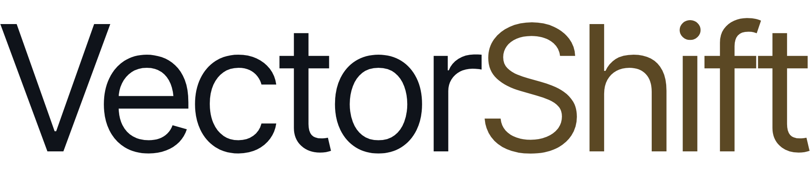
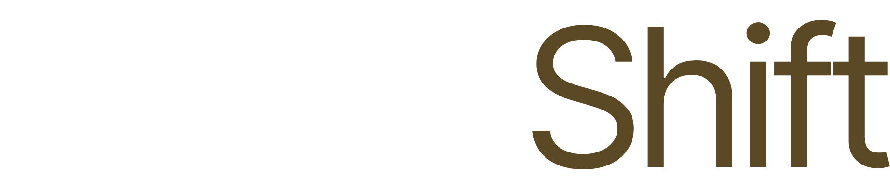

# Anti-dilution protection — Glossary — VectorShift

> Anti-dilution protection adjusts preferred stock's conversion price down in a lower-priced round, shielding investors from down-round dilution.

**Source**: [https://vectorshift.ai/glossary/anti-dilution-protection](https://vectorshift.ai/glossary/anti-dilution-protection)

---

* [Home ](/)
* [Product ](/product)
* [Use Cases ](/use-cases)
* [Security ](/security)
[Log In ](https://app.vectorshift.ai)[Request Demo ](#)

[Resources ](/resources)/ [Glossary ](/glossary)/ Anti-dilution protection 

# Anti-dilution protection . 
**Aka. **Anti-dilution adjustment · Price protection · Ratchet 

Updated June 3, 2026 

[All terms ](/glossary)

## What is anti-dilution protection? 
Anti-dilution protection is a provision attached to preferred stock that shields an investor from the dilutive effect of a later financing done at a lower price per share — a down round. If the company sells new shares below the price the investor paid, the provision lowers the investor's conversion price, so their preferred converts into more common shares than it otherwise would. 

The effect is purely on conversion economics, not on cash. The investor does not receive new money or new certificates; instead, the ratio at which their preferred converts to common improves, increasing their effective ownership when conversion occurs. The cost of that adjustment is borne by the holders without protection — typically founders and common shareholders. 

This price-based anti-dilution is distinct from the simpler concept of dilution from issuing more shares generally. It specifically addresses the harm of a *cheaper *later round, and it is one of the most negotiated economic terms in any preferred financing. 

## Full ratchet versus weighted average 
There are two main formulas, and the choice dramatically changes how punishing the adjustment is. 

* **Full ratchet. **The harshest form. The investor's conversion price is reset all the way down to the new, lower issue price — as if they had originally paid that lower price — no matter how few shares were sold in the down round. This is very investor-favorable and heavily dilutive to founders. 
* **Broad-based weighted average. **The market standard. The conversion price is adjusted using a formula that accounts for both the lower price *and *how many shares were issued at it, weighted against the company's total capitalization. A small down round produces only a modest adjustment. 
* **Narrow-based weighted average. **A middle variant using a smaller share count in the formula, producing a larger adjustment than broad-based but less than full ratchet. 
Weighted average — particularly broad-based — is by far the most common in venture deals; full ratchet appears mainly in distressed or highly investor-favorable situations. 

## Why anti-dilution matters and how pay-to-play interacts 
Anti-dilution shifts down-round risk from investors to founders and common holders. In a down round, the protection can meaningfully re-cut the cap table — which is why founders push for the gentler weighted-average formula and a broad base, and why the term is fought over at term-sheet stage even though it only bites if the company stumbles. 

A common counterweight is a **pay-to-play **provision, which conditions an investor's anti-dilution protection (and sometimes their preferred rights generally) on participating pro rata in the down round. Investors who do not put in fresh capital lose their protection — often converting to common — which discourages investors from sitting back and relying on price protection alone while others refinance the company. 

## Frequently *asked. *
*5 questions *01 When does anti-dilution protection kick in? 

Only when the company issues new shares at a price per share lower than what the protected investor paid — a down round. If subsequent rounds are at higher prices, the provision does nothing. It is dormant unless and until a cheaper financing occurs. 

Standard carve-outs exclude option-pool issuances, certain conversions, and other non-financing share grants from triggering the adjustment. 02 What is the difference between full ratchet and weighted average? 

Full ratchet resets the investor's conversion price all the way down to the new, lower price regardless of how many shares were issued — maximally protective of the investor and harshly dilutive to founders. Weighted average adjusts the conversion price using a formula that accounts for both the lower price and the size of the down round relative to total shares, producing a far gentler adjustment. 

Broad-based weighted average is the market standard; full ratchet is reserved for distressed or unusually investor-favorable deals. 03 Who bears the cost of anti-dilution protection? 

The holders without protection — typically the founders and other common shareholders. When protected preferred converts at an improved ratio, those extra common shares come at the expense of everyone else's ownership percentage. That is why anti-dilution is fundamentally a risk-shifting term between investors and the common stock. 04 What is a pay-to-play provision? 

A pay-to-play provision conditions an investor's protective rights — often including anti-dilution — on participating pro rata in a future (often down) round. Investors who decline to invest their share lose the protection, frequently converting to common. It is designed to ensure investors who benefit from anti-dilution also help fund the company when it needs capital. 05 How is anti-dilution tracked across financing rounds? 

Each round can adjust prior series' conversion prices, and the cumulative effect on ownership is easy to miscalculate by hand across multiple down and up rounds. Keeping the anti-dilution formulas, conversion prices, and carve-outs cross-referenced with the cap table and queryable means the true as-converted ownership is accurate at the next financing or exit, rather than reconstructed from layered term sheets. 

## Related *terms *
[

P legal governance 

#### Pay-to-play 
A financing term that penalizes investors who <em>don't participate</em> pro rata in a new round, typically by converting their preferred into common. 

Open ](/glossary/pay-to-play)[

T legal governance 

#### Tag-along rights 
A minority protection letting smaller holders <em>join a sale</em> a majority shareholder has negotiated, selling on the same terms rather than being left behind. 

Open ](/glossary/tag-along-rights)[

M legal governance 

#### Most favored nation 
A clause guaranteeing one party terms <em>no worse</em> than any other counterparty gets — if someone later negotiates a better deal, the MFN holder gets it too. 

Open ](/glossary/most-favored-nation)[

I legal governance 

#### Information rights 
An investor's contractual right to receive the company's <em>financials and key data</em> on a set schedule — and often to inspect its books and records. 

Open ](/glossary/information-rights)[

I legal governance 

#### Indemnification cap 
The ceiling on how much a seller can be required to pay a buyer for breaches of the deal's representations — the maximum dollar exposure after close. 

Open ](/glossary/indemnification-cap)[

B legal governance 

#### Board control 
Holding enough seats to command a majority of board votes — the power to <em>decide</em> the matters that the board, not shareholders, controls. 

Open ](/glossary/board-control)

## See how *VectorShift *works for your firm 
[Request Demo ](#)

* [Product ](/product)
* [Use Cases ](/use-cases)
* [Security ](/security)
* [Resources ](/resources)
* [Docs ](https://docs.vectorshift.ai/)
* [Privacy ](/data-and-privacy)
* [Terms ](/terms-conditions)
* [contact@vectorshift.ai ](mailto:contact@vectorshift.ai)
© 2026 VectorShift, Inc. 

× 

Live Demo 

## See what your team can accomplish 
Get a personalized walkthrough from one of our experts and discover how we can help your business move faster. 

* See the platform live with your own data 
* Get answers from a product expert 
* No commitment required 

### Request a Demo 
We'll be in touch within one business day. 

First Name 

Last Name 

Work Email Please use your work email address. 

Company 

Phone Number 

🇺🇸 +1 🇬🇧 +44 🇮🇳 +91 🇦🇺 +61 🇩🇪 +49 🇫🇷 +33 🇸🇬 +65 🇦🇪 +971 🇯🇵 +81 🇨🇳 +86 🇧🇷 +55 🇳🇱 +31 🇪🇸 +34 🇮🇹 +39 🇨🇭 +41 🇸🇪 +46 🇮🇪 +353 🇭🇰 +852 

Request Demo 

By submitting you agree to our [Terms ](/terms-conditions)& [Privacy Policy ](/data-and-privacy). 

✓ 

### Thanks for reaching out 
We'll be in touch at ****within one business day to find a time. 

× 

VectorShift Research 

### Stay ahead of private markets 
Research and market intelligence for private-markets professionals. 

First Name * 

Work Email * 

Subscribe 

By subscribing, you agree to receive emails from VectorShift and to our [Privacy Policy ](/data-and-privacy). Unsubscribe anytime. 

✓ 

### You're subscribed. 
Thanks for signing up.